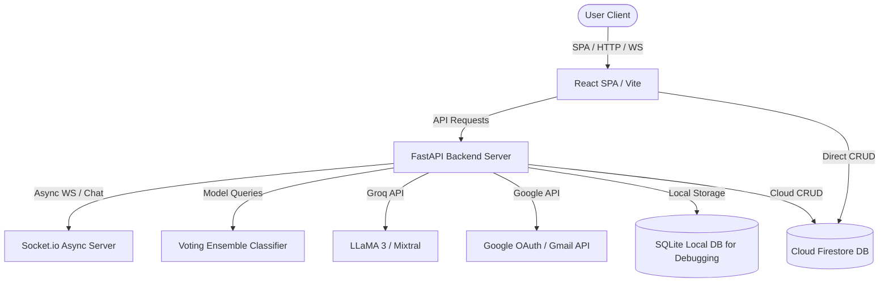
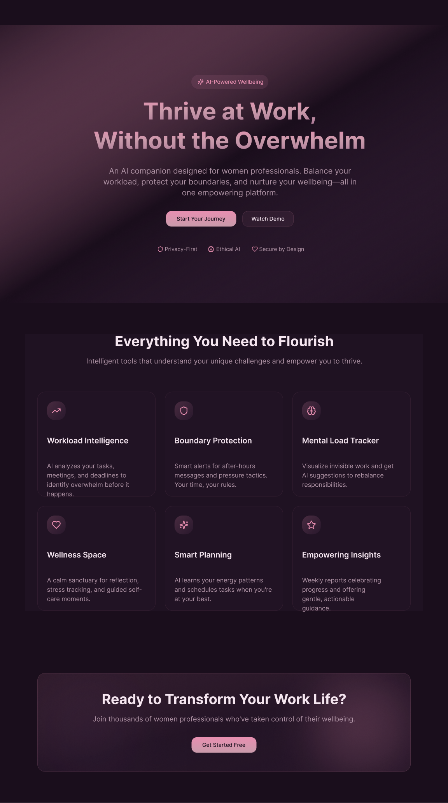

# Flourish

AI-powered workplace wellness platform combining conversational AI, burnout prediction, intelligent scheduling, and real-time productivity insights.

[](https://fastapi.tiangolo.com/)
[](https://react.dev/)
[](https://www.typescriptlang.org/)
[](https://firebase.google.com/)
[](https://groq.com/)
[](LICENSE)

**Live Demo**: [tea-hack.vercel.app](https://tea-hack.vercel.app/)

---

## Project Metrics

| Component | Value / Tech |
| --- | --- |
| **Frontend** | React 18 + TypeScript (Vite SPA) |
| **Backend** | FastAPI (Python 3.10) |
| **ML Predictors** | Voting Ensemble (XGBoost, Random Forest, Gradient Boosting) |
| **Databases** | Cloud Firestore (Primary) + Local SQLite (Debug Datastore) |
| **Real-time Engine**| Python-SocketIO WebSockets |
| **Integration APIs**| Groq (LLaMA 3) & Google Gmail OAuth |
| **Testing Engine** | pytest |

---

## Key Highlights

*   **⚡ AI Smart-Fill Metric Extraction**: Processes free-form user descriptions of their week using Groq-powered LLMs to automatically estimate well-being and stress metrics.
*   **🧠 Machine Learning Burnout Watch**: Leverages a trained voting ensemble model (incorporating Random Forest, Gradient Boosting, and XGBoost classifiers) to predict personal burnout risk.
*   **📅 Energy-Aware Auto-Scheduler**: Features a cognitive prioritization engine that dynamically reorders weekly timelines, matching scheduled work to personal energy boundaries.
*   **🛡️ Tone Shield Communication Armor**: Sanitizes inbound and outbound emails using LLM sentiment classification to detect and rewrite aggressive professional communications.
*   **🚖 Safe Cab Booking**: Implements a secure ride-sharing booking portal equipped with custom calendars, clock popups, carpooling rules, and emergency trusted contacts.
*   **🏡 Invisible Labor Tracker**: Promotes equity by logging unpaid domestic labor and family-care hours, displaying holistic progress via dynamic visual charts.

---

## Architecture at a Glance



---

## Table of Contents
- [Features](#features)
- [Tech Stack](#tech-stack)
- [System Architecture](#system-architecture)
- [Project Structure](#project-structure)
- [Installation](#installation)
- [Usage](#usage)
- [Screenshots](#screenshots)
- [API Overview](#api-overview)
- [Database](#database)
- [Contributors](#contributors)
- [License](#license)

---

## Features

| Feature | Description | Target Mode | Status |
| ------- | ----------- | ----------- | ------ |
| **Burnout Watch** | Calculates work fatigue using a trained ensemble ML model (Gradient Boosting/XGBoost). Includes AI text parsing. | Work | Complete |
| **Auto Scheduler** | Re-prioritizes tasks to coordinate with employee energy peaks. | Work | Complete |
| **Tone Shield** | Checks and rewrites aggressive emails to diffuse tension. | Work | Complete |
| **Safe Cab** | Books work commutes. Features automated safety notifications. | Work | Complete |
| **Diet Planner** | Generates meal calendars tailored to daily macro targets. | Home | Complete |
| **Period Tracker** | Tracks cycles and suggests workout levels relative to phase. | Home | Complete |
| **Invisible Labor Log**| Logs and charts unpaid domestic labor (childcare, cleaning, etc.). | Home | Complete |

---

## Tech Stack

| Layer | Technologies | Purpose |
| ----- | ------------ | ------- |
| **Frontend** | React 18, Vite, TypeScript, Tailwind CSS, Framer Motion, Recharts | User Interface & Animations |
| **Backend** | FastAPI, Python-SocketIO, Uvicorn, LangChain, Pydantic | REST API & Real-time WebSockets |
| **Databases** | Cloud Firestore (Production), SQLite (Local Relational SQL) | Distributed NoSQL & Local Sandboxing |
| **Machine Learning**| XGBoost, Scikit-Learn, Pandas, Numpy, Joblib | Burnout prediction & data pre-processing |
| **AI Models** | Groq (Llama 3 / Mixtral-8x22b) | Natural language interface & translation |

---

## System Architecture

Flourish implements a decoupled client-server architecture:
*   **Frontend SPA**: A single-page application built with React, Vite, and TypeScript. State is managed locally through React context providers (`AuthContext`, `ThemeContext`, `ModeContext`).
*   **Backend Server**: A FastAPI application wrapped in an ASGI server to support asynchronous Socket.io WebSocket connections.
*   **Database Managers**: Supports a dual database layer. Production deployments query Cloud Firestore for user-level collections, while local environments support SQLite relational tables for debugging.

---

## Project Structure

| Directory | Purpose |
| --------- | ------- |
| [`.github/workflows/`](.github/workflows/) | CI/CD automated linting and formatting workflows |
| [`assets/`](assets/) | Visual resources and project screenshots |
| [`backend/`](backend/) | FastAPI Python backend source code, routes, ML models, and scraping engines |
| [`docs/`](docs/) | Extended architectural specification documents |
| [`frontend/`](frontend/) | React & Vite single-page application codebase |
| [`sql/`](sql/) | Database migrations and SQLite sandbox database schema scripts |

---

## Installation

### Prerequisites
- Node.js (v20 or higher)
- Python (3.10 or higher)

### 1. Backend Setup:
```bash
cd backend
python -m venv venv
source venv/bin/activate  # Windows: venv\Scripts\activate
pip install -r requirements.txt
uvicorn main:app --reload
```

### 2. Frontend Setup:
```bash
cd frontend
npm install
npm run dev
```

---

## Usage

### Environment Configuration
Setup `.env` configuration files inside both root directories.

**Backend (`backend/.env`)**:
```env
GROQ_API_KEY=gsk_...
ENCRYPTION_KEY=fernet_secret_key
FRONTEND_URL=http://localhost:5173
```

**Frontend (`frontend/.env.local`)**:
```env
VITE_FIREBASE_API_KEY=AIzaSy...
VITE_FIREBASE_PROJECT_ID=flourish-project
VITE_BACKEND_URL=http://localhost:8000
```

---

## Screenshots

### Landing Dashboard Preview
[](https://tea-hack.vercel.app/)

---

## API Overview

For comprehensive specification parameters, refer to [docs/API.md](docs/API.md).

| Endpoint | Method | Purpose |
| -------- | ------ | ------- |
| `/api/auth/google/url` | `GET` | Generates redirect link for Gmail access authorization. |
| `/api/auth/google/firebase-token` | `POST` | Saves credentials returned by Google Client logins. |
| `/api/scheduler/chat` | `POST` | Handles energy-scheduler conversation messages. |
| `/api/scheduler/generate` | `POST` | Builds optimized daily timeline models. |
| `/api/burnout/predict` | `POST` | Calculates burnout index via the XGBoost / Ensemble engine. |
| `/api/tone/analyze` | `POST` | Reviews message formatting to evaluate conflict. |

---

## Database

Flourish supports dual database managers. Cloud deployments target Firestore document-store collections, while local sandboxes initialize relational tables in SQLite for local testing and script execution.

Refer to [Database Design](docs/Database.md) and [SQLite Schemas](sql/schema.sql) for explicit schemas of tables:
- **`employees`**: Tracks labor hour constraints and workload assignments.
- **`tasks`**: Backlog of task items with assigned time-durations.
- **`schedules`**: Time-allocated associations of employees and tasks.
- **`conversation_sessions` & `conversation_logs`**: Backs the AI chat interfaces.

---

## Contributors

*   **Ayushi Ranjan** - [GitHub](https://github.com/ayushiii2707)

---

## License

This project is licensed under the MIT License - see the [LICENSE](LICENSE) file for details.
