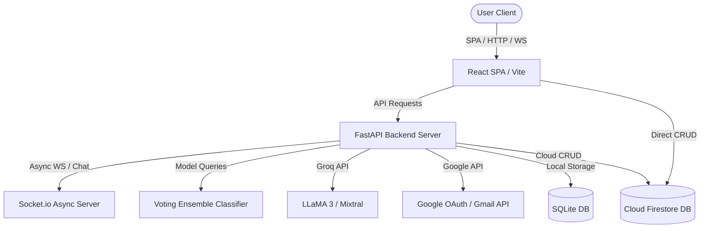

# Architecture & Data Flow

This document details the system design, components, and data pipelines behind Flourish.

## High-Level System Architecture

Flourish utilizes a decoupled client-server architecture with dual database support and external AI model integration:

## Core Workflows

### 1. Burnout Prediction Pipeline
1. User provides workload inputs (Stress, Job Satisfaction, Work Hours, Caregiving, etc.) either manually or via **AI Smart-Fill**.
2. If AI Smart-Fill is used, text description is sent to Groq LLM to extract metrics.
3. The metrics are dispatched to the FastAPI `/api/burnout/predict` endpoint.
4. The backend loads the pre-trained `athena_burnout_model.pkl` (a Voting Classifier ensemble incorporating Random Forest, XGBoost, and Gradient Boosting).
5. The model outputs a prediction probability representing the burnout risk level (e.g. low, moderate, high).

### 2. Auto-Scheduling Optimizer
1. Tasks are entered into the database (SQLite or Firestore).
2. The user initiates a calendar build via the `/api/scheduler/generate` endpoint.
3. The `SchedulerEngine` queries the tasks and availability constraints.
4. The system queries the Groq client (`GroqSchedulerAI`) to run cognitive prioritizations based on deadlines and energy levels.
5. An optimized day-by-day bento timeline is returned to the client.

### 3. Real-Time Chat (Socket.io)
- Standard HTTP endpoints handle HTTP REST request lifecycles.
- An ASGI Socket.io server handles active connections (`connect`, `disconnect`, `join_room`, `send_message`, `typing`).
- Ideal for low-latency peer messaging and updates.
